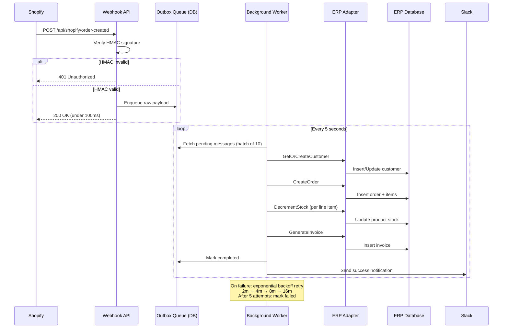

# Shopify → ERP Real-Time Order Sync

**Production-grade .NET 8 integration engine** that receives Shopify `order/created` webhooks, verifies them cryptographically, queues them reliably, and syncs them into any ERP system — with a live Blazor monitoring dashboard.

> 🎬 **[Watch the demo on Loom](#)** ← placeholder, add after recording

---

## Why this exists

Every Shopify store that uses a separate ERP (inventory, invoicing, accounting) needs orders to flow between them automatically. The naive approach — calling the ERP directly from the webhook handler — loses orders on ERP downtime, creates duplicates on retries, and has no visibility into what failed and why. This project solves all three.

---

## Architecture



---

## Features

### Reliability
- **Outbox pattern** — orders survive API restarts; nothing lost between webhook receipt and ERP sync
- **Idempotency** — same Shopify order ID processed twice creates exactly one record
- **Exponential backoff** — transient ERP failures retry at 2m → 4m → 8m → 16m intervals
- **Database transactions** — customer + order + stock + invoice created atomically or not at all

### Adaptability
- **3 built-in adapters** — **SQL** (custom/legacy databases), **REST API** (NetSuite, SAP, Dynamics 365), **Odoo Community** (XML-RPC + API key, tested on Odoo 19)
- **Swap adapters with one config line** — `ERP_ADAPTER=Sql|RestApi|Odoo`
- **Interface-driven** — `IErpAdapter` has 4 methods; implement them for any ERP in under 200 lines

### Observability
- **Blazor dashboard** — live view of orders, inventory, outbox queue, audit log; auto-refreshes every 5s
- **Audit log** — every webhook received, HMAC failure, order synced, duplicate skipped — persisted to DB
- **Slack notifications** — success and failure alerts; falls back to console log if not configured
- **Serilog** — structured logging throughout

---

## Tech Stack

| Layer | Technology |
|---|---|
| Webhook API | .NET 8 Web API |
| Background processing | .NET 8 `BackgroundService` |
| Database | SQL Server 2022 |
| ORM | Entity Framework Core 8 |
| Logging | Serilog |
| Validation | FluentValidation |
| Dashboard | Blazor Server + Tailwind CSS |
| Testing | xUnit + FluentAssertions + Moq |
| Containerization | Docker + docker-compose |
| ERP Integration | Odoo 19 Community (XML-RPC, API key auth) |

---

## Quick Start

```bash
git clone https://github.com/yourusername/shopify-erp-sync
cd shopify-erp-sync
cp .env.example .env
# Edit .env with your Shopify webhook secret (optional for local testing)
docker-compose up --build
```

- **API:** http://localhost:5010
- **Dashboard:** http://localhost:5011

### Send a test webhook (no Shopify required)

```powershell
# Computes real HMAC, sends to local API
.\requests\send-webhook.ps1
```

Watch the order appear in the dashboard within 5 seconds.

### Run without Docker

```powershell
# Requires SQL Server on localhost
dotnet run --project src/ShopifyErpSync.Api
dotnet run --project src/ShopifyErpSync.Dashboard
```

---

## Production Considerations Already Handled

- **HMAC verification** with constant-time comparison (prevents timing attacks)
- **Request body buffering** — body read once by middleware, rewound for controller
- **Scoped services in hosted service** — `IServiceScopeFactory` prevents captive dependency issues
- **Non-throwing notifications** — Slack failures never propagate to the sync pipeline
- **Audit writes outside main transaction** — audit entries persist even when the sync transaction rolls back
- **Unique index on `ShopifyOrderId`** — DB-level idempotency guard as a second line of defence

---

## Connecting Your ERP

Implement one interface — 4 methods:

```csharp
public class MyErpAdapter : IErpAdapter
{
    public Task<Customer> GetOrCreateCustomerAsync(ShopifyCustomer c, CancellationToken ct) { ... }
    public Task<Order>    CreateOrderAsync(ShopifyOrder o, Customer c, CancellationToken ct) { ... }
    public Task           DecrementStockAsync(string sku, int qty, CancellationToken ct)     { ... }
    public Task<Invoice>  GenerateInvoiceAsync(Order o, CancellationToken ct)                { ... }
}
```

Then in `appsettings.json`:
```json
{ "Erp": { "Adapter": "MyErp" } }
```

And register in `DependencyInjection.cs`. Done.

### Odoo Community (built-in)

Tested on Odoo 19. Requires `sale_management`, `account`, `stock` modules installed.

```env
ERP_ADAPTER=Odoo
ODOO_BASE_URL=http://your-odoo:8069
ODOO_DB=odoo
ODOO_USER=admin@company.com
ODOO_API_KEY=your_api_key_here
ODOO_STOCK_LOCATION_ID=8
```

Generate an API key in Odoo: **Settings → Technical → API Keys → New**.

What gets created per order:
- `res.partner` — customer (keyed by `ref = shopify_{id}`, idempotent)
- `product.template` + `product.product` — one per line item SKU (created if missing)
- `sale.order` → auto-confirmed via `action_confirm`
- `stock.quant` — decremented per line item
- `account.move` (out_invoice) → posted via `action_post`

---

## Screenshots

| Shopify Orders | Odoo Sale Orders | Slack Notification |
|---|---|---|
| *(add screenshot)* | *(add screenshot)* | *(add screenshot)* |

---

## Need this for your business?

I build Shopify integrations, ERP connectors, and custom backoffice systems for e-commerce companies.

**[Hire me on Upwork](https://www.upwork.com/freelancers/~01986f4dab905abf14)**

---

*Built with .NET 8 · SQL Server · Blazor Server · Docker*
